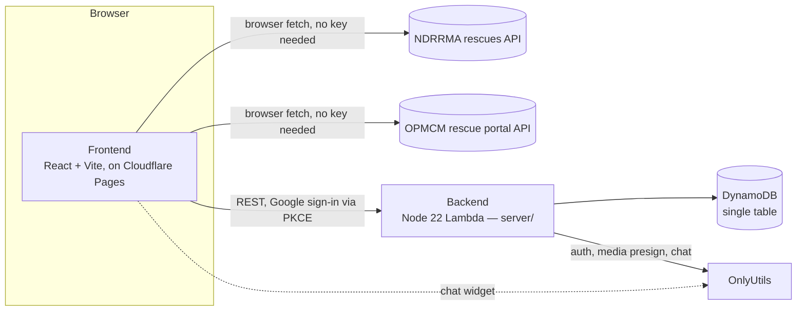

# verifiedNepal

An independent, volunteer-run disaster-response platform for Nepal, bilingual
(English / नेपाली) and mobile-first. It started as a dashboard mirroring
official data for the **2026 Rasuwa / Bhote Koshi flash flood**, then grew
into a general mutual-aid platform spanning any number of disasters across
all 77 districts — a **disaster** (flood, landslide, earthquake, fire, …) is
now its own resource: reported by the public or an admin, approved by an
admin, and every need/offer/project belongs to one. See
[docs/FEATURES.md](docs/FEATURES.md) for the full picture. The original flood
dashboard still runs alongside it:

- **Live figures** — rescued, missing, forces deployed for the 2026 Bhote
  Koshi flood specifically — fetched in the browser from NDRRMA's public API
  every 5 minutes, with a bundled snapshot as offline fallback and a visible
  live/snapshot indicator. This pipeline is unchanged and NDRRMA-specific;
  it does not cover other disasters.
- **Find a person** — name search (English or Devanagari, order-independent,
  diacritic-folded) across the officially verified rescued list *and* the
  missing-persons list.
- **Verified emergency contacts** — national disaster hotline 1234 and the
  flood-specific MoHA/MoFA control rooms, all checked against primary
  sources.
- **Relief map** — affected locations and relief camps with a district
  filter.
- **Official actions & updates** — deep links into the Government of Nepal's
  OPMCM rescue portal (report a missing person, ask for help) and its live
  coordination stats and updates feed.
- **AI assistant** — a chat widget grounded in the same live data (powered by
  [OnlyUtils](https://onlyutils.com)).
- **Mutual-aid portal** — request help (`/get-help`) or offer help
  (`/give-help`) by category, district and disaster; moderators match needs
  to offers and issue claim codes, or a verified organization takes a need
  directly and delivers it. Redeemed claims and org deliveries appear on a
  public, masked ledger. Helpers can split a big need into a group and each
  claim a piece. Helpers can browse community projects (`/projects`) with
  photo updates, read and write articles (`/articles`), and post a short
  photo-or-video story about help they gave or received, while
  district-scoped moderators work a queue at `/desk` and every action is
  recorded in a public masked audit log (`/audit`), including an admin-only
  Disasters tab for approving, rejecting or archiving reported disasters.

This is **not** a government website. It exists to make already-public
disaster information easier to read, and to coordinate volunteer relief
around it. Verify individual records on the official pages linked throughout
the site, and rely on official hotlines for any emergency decision.

## How it fits together



The dashboard half (live figures, find-a-person, relief map) talks straight
to the two government APIs from the browser — no backend involved. The
mutual-aid half (needs, offers, orgs, projects, articles, stories,
moderation) goes through `server/`, a single Lambda behind API Gateway, with
[OnlyUtils](https://onlyutils.com) handling Google sign-in, media uploads and
the chat widget. See [docs/FEATURES.md](docs/FEATURES.md) for how a need
moves from submitted to fulfilled, and [server/README.md](server/README.md)
for the backend's routes and env vars.

## Data sources

| Source | What | How |
|---|---|---|
| [NDRRMA rescues API](https://ndrrma.gov.np/api/v1/rescues/) | rescued/missing counts, person records, locations, official messages | browser fetch (CORS-open) + `pnpm sync` snapshot |
| [OPMCM rescue portal API](https://rescue.opmcm.gov.np/) | help-request coordination stats, government effort updates | browser fetch (CORS-open) |

`public/data/*.json` is the build-time snapshot written by `pnpm sync`; the
running app prefers live responses and falls back to the snapshot.

## Local development

```bash
pnpm install       # dependencies
pnpm sync          # refresh the local data snapshot (optional)
pnpm dev           # http://localhost:8765
pnpm typecheck     # TypeScript checks
pnpm test          # frontend unit checks (node --test)
pnpm build         # static production build in dist/
```

Copy `.env.example` to `.env` for the optional portal/auth wiring (`VITE_API_BASE`, `VITE_OU_CLIENT_ID`); with an empty `.env` the app renders the read-only snapshot with live NDRRMA fallback. The dev server uses port 8765 because the chat widget's origin allowlist accepts that origin.

### Backend

```bash
cd server && pnpm install && pnpm test   # fully offline — fake JWKS/DynamoDB, no AWS credentials needed
```

See [`server/README.md`](server/README.md) for env vars and routes.

## Repository layout

```
src/App.tsx                routing shell — maps URL paths to pages, sets title/language/focus
src/styles.css             design tokens (colour, radius, type) — see docs/DESIGN-GUIDELINES.md
src/components/ui/*        shadcn/ui components, generated by `npx shadcn@latest add …` (do not hand-edit)
src/components/*           app components: site header/footer, AppShell (dashboards), PageHeader, StatCard,
                           StatusBadge, EmptyState, CodeDisplay, Logo, relief map, error boundary
src/pages/*                public pages: home, find-person, missing-guide, info-help, privacy, get-help,
                           give-help, projects, articles, ledger, audit, drop-centers, donation-status,
                           register-organization, report-incident
src/desk/*                 the Desk — moderator/admin dashboard at /desk (queue, boards, flags, projects,
                           articles, stories, organizations, disasters, print, paper sync, admin)
src/org/*                  My organization — organization dashboard at /org (centers, goods ledger, team)
src/i18n/*                 en/ne string dictionaries by area — every string has both languages
src/lib/*                  api client, auth (OAuth + PKCE), live data, geo, formatting, helplines, chat
                           widget glue, service-worker rules; *.test.ts unit tests (`pnpm test`)
public/brand/*             logo files (mark, horizontal, stacked; dark and light)
public/guides/*            printable PDF guides (see Documentation below), also served at /guides/*.pdf
server/                    Lambda API (Node 22, ESM) — see server/README.md
docs/                      design system, product brief, governance, moderation and contributor docs — see below
scripts/sync.mjs           snapshot generator (NDRRMA API → public/data/)
scripts/build-geo.py       geometry builder for relief map (Overpass/OSM → public/data/geo/)
infra/deploy.sh            Cloudflare Pages deploy (dev/prod, maintainer credentials required)
.github/workflows/ci.yml         CI — typecheck, frontend + backend tests, build
.github/workflows/deploy-dev.yml auto-deploy to dev on push to main
.github/workflows/deploy-prod.yml manual prod deploy (owner-only)
```

## Documentation

| Doc | Covers |
|---|---|
| [docs/FEATURES.md](docs/FEATURES.md) | Every feature and flow, plain-English: needs/offers, disasters, missing posters, projects, articles, stories, orgs/centers, moderation, audit |
| [docs/DESIGN-BRIEF.md](docs/DESIGN-BRIEF.md) | Product brief — every page, flow, state and constraint |
| [docs/DESIGN-GUIDELINES.md](docs/DESIGN-GUIDELINES.md) | The design system: tokens, components, page patterns, accessibility, migration notes |
| [docs/GOVERNANCE.md](docs/GOVERNANCE.md) | Portal governance: roles, district scoping, audit-log policy |
| [docs/MODERATION-GUIDELINES.md](docs/MODERATION-GUIDELINES.md) | Moderator handbook: verification, masking, rejection reasons — moderators must acknowledge this before the Desk lets them act |
| [docs/CONTRIBUTOR-TODO.md](docs/CONTRIBUTOR-TODO.md) | Open, unsolved design questions written up as substantial first contributions (beneficiary deduplication, romanized-Nepali storage), plus a note on what's deliberately *not* being built |
| [docs/TODO.md](docs/TODO.md) | Short log of recently completed feature work, for context on what just shipped |
| [docs/onlyutils-media-variants-requirement.md](docs/onlyutils-media-variants-requirement.md) | Backend spec: the thumbnail/compressed media variants needed from the OnlyUtils media service |
| [server/README.md](server/README.md) | Backend env vars, every route, and how to run it fully offline |
| [CONTRIBUTING.md](CONTRIBUTING.md) | Hard rules, PR checklist, code style |

Printable guides (English; also served on the live site at `/guides/*.pdf`):
[Seeking Help](docs/VerifiedNepal-Seeking-Help-Guide.pdf),
[Providing Help](docs/VerifiedNepal-Providing-Help-Guide.pdf),
[Registering an Organization](docs/VerifiedNepal-Organization-Guide.pdf),
[Moderating](docs/VerifiedNepal-Moderator-Guide.pdf),
[Writing an Article](docs/VerifiedNepal-Writing-an-Article-Guide.pdf).

## Privacy posture

The dashboard is aggregate-only. Person records are never listed or browsable
in bulk: they appear only through an explicit name search, the search view
sets `noindex`, and `robots.txt` disallows `/search` and `/data/`. The site
sets no cookies and runs no analytics. See the in-app Privacy & Disclaimer
page for the full policy.

## Contributing

See [CONTRIBUTING.md](CONTRIBUTING.md). Corrections to data, translations,
and accessibility fixes are especially welcome. Please never add unverified
emergency numbers or unofficial donation channels — see the hard rules there.
Looking for something bigger to build? [docs/CONTRIBUTOR-TODO.md](docs/CONTRIBUTOR-TODO.md)
has open design questions written up from scratch.

## License

[MIT](LICENSE). The mirrored datasets remain the property of their
respective official sources.
