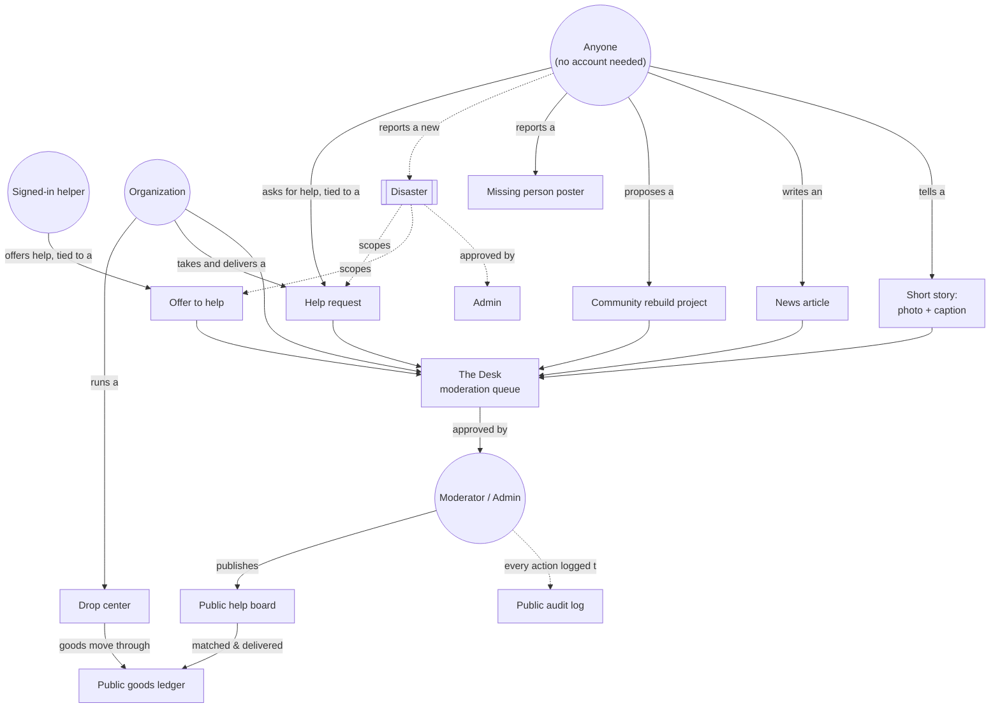
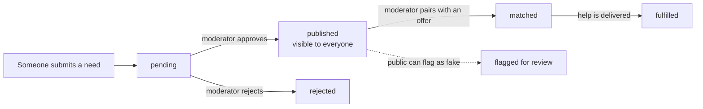
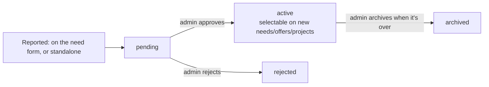
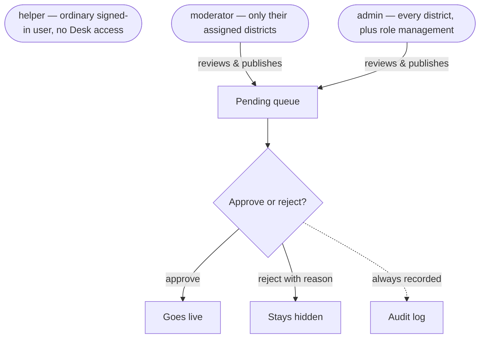
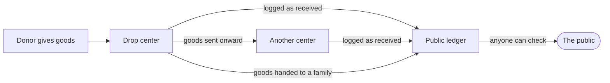
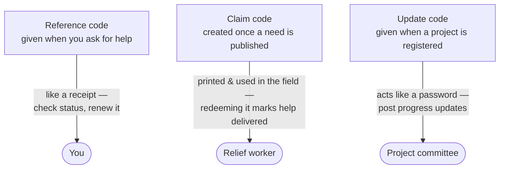

# What VerifiedNepal Does

VerifiedNepal is a website built to help during disasters in Nepal — floods, landslides,
earthquakes. It connects three kinds of people:

- People who **need help** (a family that lost their house, someone missing their relative).
- People who **want to help** (volunteers, donors, organizations).
- **Moderators** who check that everything posted is real before it goes public.

Almost nothing requires an account. You can ask for help, search for a missing person, or
read the news without signing in. Signing in (with Google) only unlocks a few things: saving
your own posters, offering to help, running an organization, or seeing your own dashboard.

This document is a plain-English map of everything the site does, for new contributors and
for anyone who wants to explain the project to someone else.

---

## The big picture

Everything public ultimately lands in one of two places people can check without logging in:
the **help board** (what's needed, what's offered) or the **ledger and audit log**
(proof that things actually happened, and who approved them).

---

## 1. Asking for help, and offering it

This is the heart of the site: `/get-help` and `/give-help`.

- **Asking for help** needs no account. Someone fills in what they need — food, shelter,
  medical help, and so on — where they are, and a short description, in English or Nepali.
  This is called a **need**.
- **Offering help** needs a Google sign-in. A helper says what kind of help they can give
  and in which districts. This is called an **offer**.

Neither a need nor an offer appears publicly right away. Both sit in a "pending" pile until
a moderator checks them on the Desk. There is no computer matchmaking — a real person looks
at the needs and offers and manually connects the right ones, only then sharing contact
details.

Two secret codes make this work without needing an account:

- A **reference code**, given right away, works like a receipt — the person who asked for
  help can use it later to check on their request or renew it before it expires.
- A **claim code**, created only once a need is published, is meant to be printed and handed
  out in the field. When help actually arrives, someone redeems the code, which marks the
  need "fulfilled" and writes a permanent line into the public ledger.

Every need, offer, and project belongs to exactly one **disaster** — see the next section.

---

## 2. More than one disaster

The site no longer covers a single flood. Each need, offer, and community project is tagged
with the disaster it belongs to, chosen from the full list of Nepal's 77 districts rather than
a fixed few.

- Someone filling in a need form can pick an already-listed disaster, or use "my emergency
  isn't listed" if theirs isn't — a house fire, a landslide nobody's registered yet. That
  inline report creates a new, unlisted disaster in the same submission, so an urgent request
  is never blocked on waiting for a disaster to be pre-approved.
- A disaster can also be reported on its own, with no attached need, by anyone signed in —
  meant for a bystander, NGO scout, or journalist flagging something before anyone has asked
  for help yet. This needs a photo as proof.
- New disasters start **pending**. An admin reviews and approves or rejects them in a Desk tab
  next to Admin; approving the need that references one activates the disaster in the same
  action. Only admins can approve, reject, or archive a disaster.

A moderator's assigned districts still work the same across every disaster — district scope
isn't reset per disaster.

---

## 3. Missing person posters

Anyone can build a poster with no account: name, age, last-seen place and time, clothing,
photo, and contact numbers. The site draws it live into a shareable image, ready to download
or send through WhatsApp or similar apps.

- Signing in lets you **save** your poster to your account, so you can edit it, delete it, or
  mark it "found" later. Without an account, your draft only lives in your own browser.
- A separate tool, **Find a Person**, searches two official government lists of missing and
  rescued people by name — it does not search posters made on this site.
- **Missing Person Guide** is just a page of good advice: what to do first, how to file a
  police report, which hospitals and hotlines to check.

---

## 4. Accounts (My Page)

Signing in uses Google, through a shared login service the site trusts — VerifiedNepal never
sees your password.

Once signed in, `/me` is your personal dashboard: your saved posters, the needs you
submitted, and the offers you made, all in one place, private to you.

The rule of thumb: **asking for help never requires an account** (you can stay anonymous),
but **offering help, running an organization, or managing a project always does.**

---

## 5. The Desk — where moderators work

The Desk is the review room. Only moderators and admins can get in — everyone else is
redirected elsewhere. It has one queue for pending needs and offers, plus tabs for projects,
articles, organizations, flagged posts, and (for admins only) assigning roles.

Before editing something, a moderator "claims" it — a 10-minute lock so two moderators can't
step on each other's work at the same time. The lock just quietly expires if it's not renewed;
nobody can be locked out forever.

---

## 6. Organizations

Any signed-in person can register an organization — its name, the districts it works in,
contact details — at `/register-organization`. Like everything else, it starts pending until
a moderator verifies it.

A verified organization gets a **trust tier** (shown publicly), based on how it was verified:
self-declared, vouched for by another verified org, or independently known. This tier carries
over to every drop center the organization runs.

Inside the org's own dashboard, the person who created it (the **owner**) can invite
teammates (**staff**) by email to help manage the organization, its centers, and its
donations.

A verified organization can also **take on a published need** directly from the Give-help
board — a staff member claims it, sees the beneficiary's contact details in the org dashboard,
and either marks it delivered (which writes the public ledger under the org's name, the same
outcome as a claim-code redemption) or hands it back to the open pool. This is a second path to
"fulfilled" alongside the claim-code system, sharing the same underlying code so a need can
only ever be marked fulfilled once.

*(Note: "group" is used two different ways in this codebase. An **organization** is a
formally verified team. A **group**, described at the end of this document, is a much more
casual cluster of neighbors helping with one specific request — they share a word, not a
concept.)*

---

## 7. Drop centers and the goods ledger

A **drop center** is a real, physical place — run by a verified organization — where relief
goods are collected or handed out: an address, opening hours, and which kinds of goods it
accepts (rice, tents, blankets, medicine, and so on).

Every time goods move — arriving at a center, leaving it, or transferring between two
centers — it's written into the **goods ledger**. The ledger is completely public, needs no
login, and can be browsed by district or downloaded as a spreadsheet at `/ledger`.

This exists for one reason: so anyone can verify that donated goods actually reach people,
instead of just trusting an organization's word.

---

## 8. Community projects

A **project** is a local rebuild effort after a disaster — a footbridge, a trail, a water
system, a school. Anyone can register one, describing the work, its estimated cost, and a
responsible committee with contact and payment details (bank, eSewa, Khalti) for receiving
donations. It goes live only after a moderator verifies the committee.

Registering a project returns a secret **update code** — it works like a password. Whoever
holds it (usually the committee, no account needed) can post progress updates with photos and
how much has been spent, which also go through moderator approval before appearing publicly.
It's a lightweight, honest paper trail rather than formal accounting.

---

## 9. Articles — news and reporting

An **article** is a short update from the ground: a situation report, a report from the field,
news about the relief effort, tagged by topic (floods, landslides, community stories, and so
on). Writing requires a Google sign-in. Authors can save drafts, add a cover and sourced image
or video blocks, return later to edit, and submit for moderator review. Published articles show
the author's display name and place, but never their account email. Readers can view, like and
share published articles; the page keeps simple counters for each.

Every article still goes through moderation before it is public. Older plain-text articles
continue to render without a migration.

---

## 10. Stories — a quick personal account

A **story** is much smaller than an article: one photo or video plus a short caption, from
someone whose own need was fulfilled, who helped as a volunteer, or who belongs to an
organization that delivered aid through a drop center. There's no editor, no title, no tags —
just proof and a sentence.

Only people the site can already show *did* one of those three things are allowed to post one
— the eligibility check runs against their own needs, offers, and org's deliveries, not a
self-declared role. Stories go through the same moderation queue as everything else before
appearing in the public strip on the home page.

---

## 11. Climate page

An educational page showing which countries have historically contributed the most to global
warming — a ranking, trend charts, and a breakdown by gas and by source. The numbers come
from a pre-loaded academic dataset, not a live feed. It connects global climate change to the
kind of disasters (glacier melt, floods) that make this whole platform necessary, but it isn't
otherwise linked to the relief or donation systems.

---

## 12. Donation status

Lets a donor check on one specific gift using a short code or link: has it been received at
its drop center yet, and how much of that type of goods has since gone back out to people who
need it. It's the thread connecting one person's donation to the shared public ledger.

---

## 13. Audit log

A public, month-by-month record of every moderation decision on the site: every publish,
every rejection, every organization verified, every request matched or fulfilled — who did
it, when, and why, with personal names hidden. No login needed. Its whole purpose is to prove
that moderators are accountable, not acting in the dark.

---

## 14. Other pages

- **Info & Help** — general information and emergency contact numbers.
- **Privacy** — the site's privacy policy.
- **Home** — the landing page: a quick overview and shortcuts into everything above.

---

## How trust works without forcing everyone to log in

The whole site is built around one idea: you shouldn't need an account just to ask for help
or check that help is real. Instead of logins, it uses short, private codes:

Alongside this, public names are always shown masked (for example "Ram K." instead of a full
name), so the system can stay open and transparent without exposing anyone's identity.

And every kind of public submission — needs, offers, organizations, articles, stories,
projects, project updates, and standalone disaster reports — follows the exact same pattern:
**a contributor can submit it, nothing is public until a moderator or admin approves it, and
every approval is logged.** Once you understand this pattern once, you understand most of the
site.

The whole interface is also fully bilingual: every piece of text exists in English and
Nepali side by side, and a language switch just changes which set of text is shown.

---

## 15. Helper groups

When one need is too big for a single volunteer — say, a family that lost their house needs
shelter *and* food *and* transport — a helper can split that published need into smaller
pieces on the Give-help board, and other helpers each claim one piece, coordinating as an
informal group. No custom group branding is allowed (this is disaster relief, not a
marketplace), and it never changes how the original request gets marked "delivered" — that
part still only happens through the claim-code or org-fulfillment system described above.
A helper who finishes their piece of a group counts as "helper" for the Stories feature.

---

*This document describes the platform's features in plain language. For how the code is
actually built, see the `server/` and `src/` directories and their own READMEs.*
