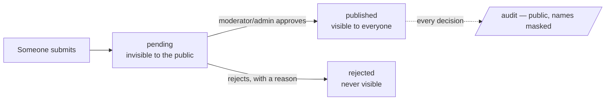

# VerifiedNepal — User Flows (as observed on dev, 2026-09-06)

For the UI/UX review. Every flow below was walked on `https://dev.verifiednepal.com` by five automated testers (anonymous, helper, moderator, admin, and a UX/a11y audit) alongside the dev dataset. Screenshots are in `screenshots/` (named `<run>--<shot>.jpg`); the raw per-run findings are in `findings/`; the consolidated defect list with IDs (`VN-nn`) is in [E2E-TEST-REPORT.md](E2E-TEST-REPORT.md). Where a flow step cites a `VN-nn`, that is the issue to look at.

How to read a flow: **Entry → Steps (screen · action · system response) → Exit**, then *States/branches*, then *What the reviewer should look at*.

---

## 0. The one pattern behind everything

Principle #1 of the product is **"Verified is the product."** Every public submission follows the same shape, and the site's trust story depends on it holding for every content type:

Observed on dev: this holds for **needs, offers, projects, articles, stories, organizations, disasters, and saved missing-person posters** (each verified end to end or via API). The incidents API still leaks *pending* reports to anonymous callers (`VN-02`) even though the page hides them.

Three roles + anonymous:

| Who | Can | Enters through |
|---|---|---|
| Anonymous | Ask for help, build a poster, search, read everything public, flag a listing, donate goods (with Turnstile) | any page |
| Helper (signed in) | Offer help, save posters, write articles/stories, propose projects, register an organization, join helper groups, report a disaster | `/desk/login` → back to where they were |
| Moderator | Everything a helper can + the Desk (queue, boards, print/sync, flags, projects, articles, stories, orgs) inside their districts | `/desk/login` → guidelines → districts → `/desk` |
| Admin | Everything + Admin, Disasters, Climate tabs; no district limit; no guidelines gate | `/desk/login` → `/desk` |

Sign-in is Google via OnlyUtils in production; on dev a second "Test account sign-in (dev only)" form exists for the dev accounts ([../../BETA-TESTING.md](../../BETA-TESTING.md)).

---

## 1. Route map

| Route | Purpose | Who | Data-dependent states seen |
|---|---|---|---|
| `/` | Front page: emergency bar, live flood figures, Get/Give help CTAs, stories strip, shortcuts | all | long page (≈4,700px); stats are 2026-flood specific |
| `/get-help` | Register a need (for yourself or on behalf of someone) | all | empty · validation · on-behalf fields · Turnstile · success/refCode · draft-restore banner |
| `/give-help` | Needs board + "Register an offer" | all (offer needs sign-in) | signed-out gate · empty board · incident switcher · offer dialog · success |
| `/search` | Find a person in official rescued/missing lists | all | results · Devanagari · no-match · min-length |
| `/missing` | Missing-person guide | all | static |
| `/poster`, `/poster/new`, `/poster/:id` | Public poster board · builder · saved poster | all (save needs sign-in) | board filters Missing/Found/Safe · live 1080×1080 preview |
| `/projects`, `/projects/:id`, `/projects/register`, `/projects/update` | Community rebuild projects | all (register needs Turnstile; update needs update code) | empty · 404 · Turnstile block |
| `/articles`, `/articles/:id`, `/me/articles`, `/me/articles/:id/edit` | Community articles: read · my list · block editor | read: all; write: helper | draft · pending (read-only) · published · rejected |
| `/incidents`, `/report-incident` | Disasters list · report one (photo required) | read: all; report: helper | pending hidden · active · archived tab |
| `/register-organization`, `/org` | Register an org · org dashboard (team, centers, needs, ledger) | helper | unverified (gated) · verified |
| `/drop-centers`, `/drop-centers/:id`, `/donation/:code` | Public centers · center detail (stock, flag, donate) · donation status | all | empty · 404 |
| `/ledger`, `/audit` | Public fulfilment ledger (CSV/print) · public moderation audit (month) | all | need district / month first; audit cached 60 s |
| `/climate` | Educational climate page + message wall | all | very long/heavy; message wall needs Turnstile |
| `/me` | Personal dashboard | helper+ | signed-out nudge · empty · populated |
| `/desk/login` | The single sign-in screen | all | Google · dev test form · error |
| `/desk` | Moderation desk (sections are in-page buttons, not routes — `VN-26`) | moderator/admin | guidelines gate · district gate · queue · boards · print · sync · flags · projects · articles · stories · orgs · disasters* · admin* · climate* |
| `/info`, `/privacy` | Info & hotlines · privacy policy | all | static |
| unknown path | — | — | renders the home page (`VN-05`) |

---

## 2. Flows

### F1 · Ask for help (anonymous need) — `screenshots/ux--get-help-en-mobile.jpg`, `anon--gethelp-d-02-validation.jpg`, `anon--gethelp-d-03-onbehalf-fields.jpg`, `anon--gethelp-d-04-after-submit.jpg`

Entry: home CTA "Get help", nav, or direct link. No account.

1. `/get-help` · read the intro — *"No account needed. A moderator will review before anything appears publicly"* sets the USP expectation up-front (good).
2. "Who is this for?" · choose **Myself** or **Someone else** · on-behalf reveals registrant name/phone/email + a consent checkbox; the beneficiary phone becomes optional, the registrant phone required.
3. Fill category, disaster (or "my emergency isn't listed" → inline new-disaster report), district/ward, description (EN or NE), optional photo.
4. Submit with errors · inline "7 fields need attention" + per-field messages, focus and aria wired (good).
5. Solve Turnstile · submit · **reference code** shown; the need is now *pending* and invisible everywhere public.
6. Later: "Check status" with the reference code → status page; **renew** before expiry.

Exit: reference code (the receipt). The moderator flow (F10) picks it up.

States/branches: draft auto-restore on return (`VN-16`: banner fires on the same visit); Turnstile unsolved → desktop submits anyway and shows *"Something went wrong on our side"* while mobile blocks client-side (`VN-06`); status lookup with a bad code → not found.

Reviewer focus: the Turnstile widget reads as a form field ("Verification required" over a bare checkbox); error message placement (above the button, far from the widget); the duplicated helper sentence under "Describe what is needed"; the three-card structure and "Who is this for?" framing work well.

### F2 · Give help (signed-in offer) — `ux--give-help-en-desktop.jpg`, `helper--09-offer-form.jpg`, `helper--11-offer-submitted.jpg`, `anon--givehelp-d-02-incident-test.jpg`

Entry: home CTA "Give help", nav.

1. `/give-help` signed out · needs board is readable (empty on dev) · "Register an offer" is gated behind sign-in (inline Google card + header "Sign in").
2. Sign in (F3) · returns to `/give-help` (fixed today, was `VN-07`).
3. "Register an offer" · dialog: category, districts (77 checkboxes — `VN-20`), disaster, description · header still says "Sign in with Google to register help" (`VN-30`).
4. Submit · success card with reference, below the fold, no toast.
5. `/me` shows the offer with a *Pending* badge; `GET /offers` public list does not include it.
6. After moderation: *Published* (but published offers appear on no public page — `VN-13`), *Matched* when a moderator pairs it with a need.

Exit: offer pending; helper watches `/me`.

Reviewer focus: the board's "Not tied to a specific event" default silently maps to a "general" incident; empty board carries offline-hint copy; the tab pills are 28px tall (`VN-25`).

### F3 · Sign in and My Page — `ux--desk-login-en-mobile.jpg`, `ux--desk-login-ne-mobile.jpg`, `ux--me-signedout-en-mobile.jpg`, `ux--me-en-desktop.jpg`, `helper--33-me-populated-desktop.jpg`, `helper--34-me-populated-mobile.jpg`, `helper--37-avatar-menu.jpg`

Entry: header "Sign in", `/me` nudge, any gated action.

1. `/desk/login` · "Continue with Google" (prod) — on dev also the "OR · Test account sign-in (dev only)" form.
2. Google: PKCE redirect → back to `/desk` → then to the page you started on. Test form: direct login → same return.
3. Helpers who land on `/desk` are bounced to `/org` with no explanation (`VN-24`).
4. `/me` · dashboard sections with proper empty states: needs you submitted, offers, saved posters, articles, stories, incidents you reported, organization shortcut.
5. Avatar menu · only "Sign out"; sign-out clears tokens and the header.
6. Tokens are 15 minutes; refresh is silent (verified by forcing expiry).

States: signed-out `/me` shows a nudge card ("Not now" / "Go to home page"); "Your story" block is a dead end for new helpers (`VN-29`).

Reviewer focus: no `h1` and placeholder-only inputs on the login card (`VN-21`); language toggle label differs here from the rest of the site (`VN-22`); login photo credit contrast.

### F4 · Missing person: poster, board, find a person — `ux--poster-en-mobile.jpg`, `anon--poster-d-02-form-empty.jpg`, `anon--poster-d-03-open-detail.jpg`, `ux--search-en-desktop.jpg`, `anon--search-d-02-devanagari.jpg`, `ux--missing-board-en-desktop.jpg`

Entry: home "Find a person" / "Missing person poster", nav.

1. `/poster` board · list with Missing/Found/Safe filters and search (placeholder-only search input) · cards show status and share actions, never creator contact details.
2. `/poster/new` · builder: name, age, last seen, clothing, photo, contacts · live 1080×1080 preview · "Download picture" · *"Nothing is uploaded"* until you save.
3. Signed in: **Save** → `/poster/:id`, editable, mark **Found** later.
4. **Saved posters are pending until the Desk publishes them**; owners see moderation status/rejection reasons in `/me`, and public pages use tips and hotlines instead of creator contact details.
5. `/search` · name search across official rescued + missing lists: English or Devanagari, order-independent; "Ram" → 29 (substring matches like "Pramila"), "राम" → 50; min 2 characters.
6. `/missing` guide · "Do this first" steps, hotlines, hospitals.

Reviewer focus: tip flow and hotline prominence, search ranking, and board card hierarchy (Open/Share actions).

### F5 · Disasters (incidents) — `ux--incidents-en-mobile.jpg`, `ux--report-incident-en-desktop.jpg`, `admin--09-disasters-pending-tab.jpg`, `admin--10-disaster-edit-dialog.jpg`, `admin--12-disaster-reject-empty-reason.jpg`, `admin--25-public-incidents-after.jpg`

Entry: `/incidents` list; `/report-incident` (signed in, photo required); inline from the need form.

1. Helper reports · pending, hidden on the public page (but exposed by `GET /incidents?status=pending` — `VN-02`).
2. Admin `/desk` → Disasters · Pending tab · **Edit** (dialog, comma-separated districts), **Approve** (one click, no confirm — `VN-10`), **Reject** (reason required; reason becomes public on `/audit`).
3. Active → selectable on new needs/offers/projects · **Archive** when over (one click, irreversible).
4. Public `/incidents` shows active; archived under its tab; rejected never.

Reviewer focus: the 77-row district filter above the list on mobile; one-click destructive actions; broken proof-image fallback.

### F6 · Community project — `helper--20-project-submit-result.jpg`, `ux--projects-en-desktop.jpg`, `moderator--18-flags.jpg`

Entry: `/projects` → "Register a project".

1. `/projects/register` · describe work, cost, committee, payment details · Turnstile · submit → **update code** (acts like a password).
2. Moderator Desk → Projects · verify committee → publish.
3. Committee posts updates at `/projects/update` with the code (text, spend, photos) → moderator approves each.
4. Public `/projects/:id` shows the verified project, approved updates and published photos.

Observed: creation blocked by Turnstile in automation; the failure state shows "Something went wrong on our side" with submit enabled (`VN-06`); `/projects` empty state says you're offline while online (`VN-15`). The dev dataset populated through the API covers this flow for the human review.

### F7 · Articles — `helper--25-article-editor.jpg`, `helper--29-article-cover-uploaded.jpg`, `helper--32-my-articles-after-submit.jpg`, `moderator--20-articles.jpg`, `moderator--27-article-publish-dialog.jpg`, `ux--articles-en-mobile.jpg`

1. `/me/articles` → New · block editor autosaves a draft · add paragraph/image/video blocks, tags, author place.
2. Submit · validation lists what's missing ("Still needed: a cover image", then "cover source").
3. Cover upload · presign → CDN preview renders.
4. Submitted → *Pending*, editor becomes read-only; list still shows "Edit" (`VN-18`).
5. Moderator Desk → Articles · Publish (one click).
6. Public `/articles/:id` renders with author display name (never email); view/like/share counters (view fires even on a 404 — `VN-23`).

Reviewer focus: title input has no visible border; required-ness of cover/source surfaces only on submit.

### F8 · Stories — `moderator--21-stories.jpg`, `helper--33-me-populated-desktop.jpg`

1. Eligibility is computed, not declared: your need fulfilled, your offer matched, or your org delivered. Before that `POST /me/stories` → 403 `story_not_eligible`, and `/me` explains — but offers no path forward (`VN-29`).
2. Eligible: one photo/video + caption → pending.
3. Moderator Desk → Stories · Publish (one click) → home strip + `/stories`.

### F9 · Organizations, drop centers, goods ledger, donations — `helper--18-org-dashboard.jpg`, `helper--35-org-needs-tab.jpg`, `moderator--22-orgs.jpg`, `ux--drop-centers-en-desktop.jpg`, `ux--donation-status-en-desktop.jpg`, `ux--ledger-en-mobile.jpg`

1. `/register-organization` · name, districts (77 checkboxes — `VN-20`), contacts · submit → org dashboard reads *"Unverified — publicly visible as unverified"* (`VN-31`: contradicts the model).
2. Moderator Desk → Organizations · verify → trust tier (self-declared / vouched / known).
3. Verified org: invite staff (team tab), create drop centers (address, hours, accepted goods), log stock entries/transfers/receipts → public `/drop-centers/:id` stock and `/goods-ledger`.
4. Org takes a published need from the board (Needs tab, gated until verified) → sees private contact → **Deliver** (writes the public ledger) or hand back.
5. Public donates goods at a center (Turnstile) → donation code → `/donation/:code` shows received/re-distributed.
6. `/ledger` (fulfilments) and `/goods-ledger` (stock movements) are public, filter by district, CSV/print; the ledger page carries a Turnstile widget inline with filters (`VN-32`).

### F10 · Moderator Desk — `moderator--01-guidelines-gate.jpg`, `moderator--04-district-gate.jpg`, `moderator--09-queue-desktop.jpg`, `moderator--10-offer1-claimed.jpg`, `moderator--13b-reject-dialog-filled.jpg`, `moderator--15-boards.jpg`, `moderator--24-edit-offer-dialog.jpg`, `moderator--16-print.jpg`, `moderator--26-print-list.jpg`, `moderator--17-paper-sync.jpg`, `moderator--31-mobile-queue.jpg`, `moderator--35-public-audit.jpg`

Entry: `/desk` after sign-in.

1. **Guidelines gate** (first time) · full text, checkbox, "I have read and will follow these" · unchecked click gives no feedback · API returns 403 `guidelines_not_acknowledged` until acked (verified).
2. **District gate** · searchable checklist (good) · 1–10 districts required, never clearable afterwards · queue and filter scope to them.
3. **Queue** · pending needs/offers · public preview and private details side by side · duplicate check · **Claim** (10-minute lock, "You · 9:55") · Publish is disabled until *"I called the registrant…"* is ticked · **Reject** opens a reason dialog (button enabled before a reason — `VN-14`) whose copy *"The registrant hears this reason when called"* is the best line in the product.
4. **Boards** · published needs/offers · match need ↔ offer (issues a **claim code**) · **Edit/correct** (shows "[edited by moderator]" publicly) · redeem a single claim code here · offers get only Edit/Archive (closing an offer's loop is API-only).
5. **Print** · pick district + ward → paper claim sheet with QR codes · disabled when empty.
6. **Sync** · paste codes redeemed offline, one per line → per-code result ("unknown" for bad codes).
7. **Flags** · public reports of fake/duplicate listings → act or jump to the item.
8. **Projects / Articles / Stories / Organizations** · verify/publish (one-click for articles and stories; checkbox for needs/offers; dialog for rejects — three confirmation models, `VN-10`).
9. Everything lands on `/audit` masked — except that masking shows "Beta (." for names with parentheses (`VN-11`) and actor names duplicated (`VN-08`).

Mobile Desk: sections become a clipped horizontal strip ("Print cla…") and the chat FAB overlaps actions (`VN-28`).

### F11 · Admin — `admin--03-admin-tab-desktop.jpg`, `admin--04-admin-lookup-result.jpg`, `admin--06-admin-role-confirm-dialog.jpg`, `admin--08-admin-tab-mobile.jpg`, `admin--21-desk-climate-tab.jpg`, `admin--23-public-audit.jpg`

1. **Admin tab** · stats ("Is moderation keeping up?"), moderators table, **lookup by email** → role select + districts (77 checkboxes, no search) → **confirm dialog** restating email/role/districts, *"This will be audited"* (the pattern to reuse) → "Role updated." (shown twice).
2. Role endpoint accepts any district string (`VN-09`); self-demotion is refused (good).
3. **Disasters tab** (F5). **Climate tab** · message/download stats matching the public page.
4. Admin skips the guidelines gate and district scope.

### F12 · Helper groups (split a big need)

On a published need on the board, a helper splits it into items; others join and claim items; "done" per item; the original need is still only fulfilled via claim code or org delivery. Not exercised in wave 1 (no published needs existed); the dev dataset now covers it for the human review.

### F13 · Cross-cutting

- **Language**: EN/NE toggle persists (localStorage), `<html lang>` and `document.title` switch; NE parity is essentially complete (Devanagari:Latin ≈ 25:1 on content pages). Residual English in NE: "Skip to main content", audit month picker, incident kinds/dates, country names on climate/info, login photo credit. Toggle label is inconsistent (`VN-22`).
- **Offline**: service worker serves the full shell and forms offline; status bar switches to "Official data snapshot · Updated …" — honest and appropriate for the audience.
- **Emergency bar**: tappable `tel:` hotlines on every page, but with the status bar it takes 213px of a 390×844 viewport before any page's H1 (`VN-19`).
- **Contrast**: the muted text token (`rgb(147,143,138)`) is 3.2:1 on white — used ~188 times (`VN-03`); climate bar labels 1.47:1 (`VN-04`).
- **Accessibility baseline is good**: skip link, landmarks, one H1 per page (except login/404), labelled form inputs, alt text everywhere, visible focus rings, zero console errors on normal pages.
- **Codes instead of accounts**: reference code (seeker), claim code (field), update code (committee), donation code (donor) — the trust model without logins. Consider a single "Your codes" explainer.
- **Transparency pages** (`/audit`, `/ledger`, `/goods-ledger`) require a filter before showing anything; audit is cached 60 s; no filter by action/target; no link from a row to the item.

---

## 3. Coverage

| Area | Exercised | Method | Blocked / not covered |
|---|---|---|---|
| All 27 primary routes, EN+NE, mobile+desktop | ✓ | browser | — |
| Anonymous need submit | validation, on-behalf, Turnstile failure state | browser + API | real submit (Turnstile in headless) — populated via API instead |
| Offer → pending → publish/reject/edit/match | ✓ | browser + API | — |
| Guidelines + district gates, claim/release | ✓ | browser + API | — |
| Claim code → print → redeem → ledger | print/sync empty states | browser | needs published needs (now populated) → wave 2 |
| Projects register → verify → updates/photos | Turnstile failure state, Desk empty state | browser | populated → wave 2 |
| Articles write → submit → publish → read | ✓ incl. cover upload to CDN | browser + API | — |
| Stories eligibility → post → publish | ✓ | API + browser | media presign |
| Org register → verify → centers → goods ledger → donations → take/deliver | register, unverified gating, Desk view | browser | verify + centers + donations → wave 2 |
| Posters build/board/search | ✓ | browser | save/edit/found as helper → wave 2 |
| Disasters report → approve/edit/reject/archive | ✓ | browser + API | browser report form (Turnstile-free but not driven) |
| Admin roles/districts/stats/climate | ✓ | browser + API | — |
| Helper groups, flags | — | — | populated → wave 2 |
| Offline, a11y, contrast, tap targets, console/network | ✓ | browser instrumentation | Lighthouse-grade performance |

---

## 4. Changes since this walkthrough was captured (overnight fixes, 2026-09-07)

Screens in `screenshots/` predate these; the live dev site now differs in the following ways (see [E2E-TEST-REPORT.md §9](E2E-TEST-REPORT.md#9-fixes-applied-overnight-2026-09-06--07)):

- **Unknown URLs** show a real not-found page (F13); the mobile emergency bar is a single compact row, so every page's H1 sits ~190px from the top instead of ~378px.
- **Anonymous forms** (F1, F6, flags, donations, climate wall) keep Submit disabled until Turnstile issues a token, label the widget "Verification", and explain verification failures instead of "Something went wrong on our side"; `/ledger` shows the widget only inside the CSV download.
- **Sign-in** (F3) returns to the page you came from on both paths; helpers who open `/desk` get an explanation with My page / organization buttons; the login card has an h1 and labelled fields; the language toggle reads "नेपाली" / "English" everywhere.
- **Posters** (F4): `/poster/:id` is a read-only view with Edit for the owner; photos render on the board (dialog photo in the last batch).
- **Desk** (F10, F11): sections are routes (`/desk/boards`, `/desk/flags`, …); Boards has Match and Redeem on desktop and mobile (claim codes come from a moderator-only projection); Flags can be resolved and link to the item; Approve/Archive/Publish confirm first; reject dialogs gate on a reason and carry content-specific helper copy; dates are Kathmandu time with "NPT"; the audit page names target types and specific verbs; the 77-district walls are a searchable picker with chips; the mobile Desk nav has an overflow cue and the chat FAB is hidden.
- **Helpers / orgs** (F2, F9, F12): the give-help board no longer shows stale state after group actions; anonymous visitors get the sign-in nudge on group buttons; a need taken by an org can't also be split into a group (and vice versa, enforced server-side); phones with a leading "+" save; `/org#needs` deep-links work; declined team invites stay visible as "Declined"; article share counts update instantly.
- **Public data**: pending disasters and their reporters are no longer exposed by the incidents API; masked names are word-based ("Ram B. K."); "Sent to Sent to" and the "Look up another code" heading are gone; Renew is hidden (and refused) on fulfilled needs.
